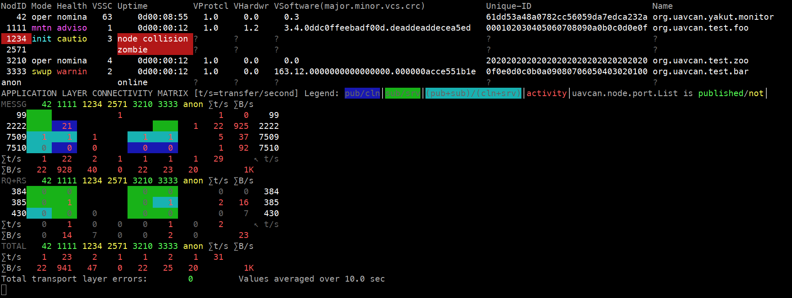
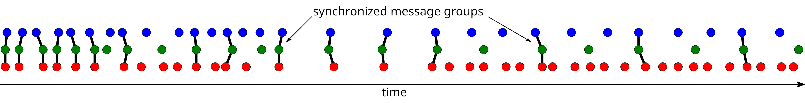
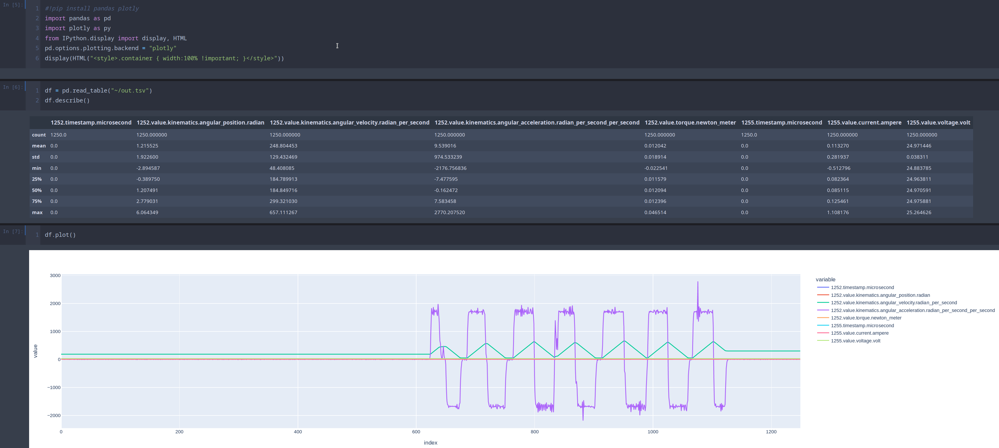
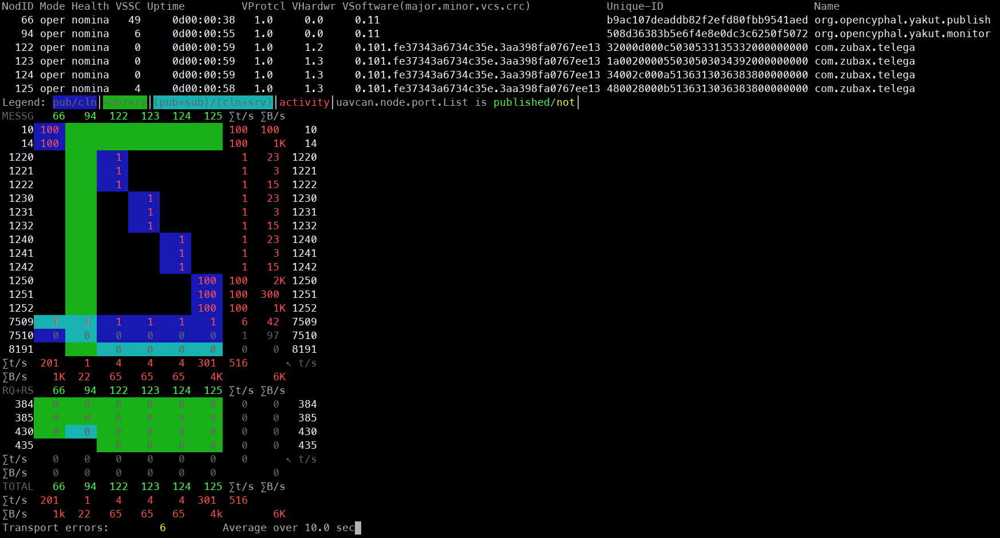

# Yakut

<!--suppress CheckImageSize, HtmlDeprecatedAttribute -->


[](https://pypi.org/project/yakut/) [](https://forum.opencyphal.org)

Yakút is a simple cross-platform command-line interface (CLI) tool for diagnostics and debugging of [Cyphal](https://opencyphal.org) networks. By virtue of being based on [PyCyphal](https://github.com/OpenCyphal/pycyphal), Yakut supports all Cyphal transports (UDP, serial, CAN, ...) and is compatible with all major features of the protocol. It is designed to be usable with GNU/Linux, Windows, and macOS.



Ask questions and get assistance at [forum.opencyphal.org](https://forum.opencyphal.org/).

## Installing

First, make sure to [have Python installed](https://docs.python.org/3/using/index.html). Windows users are recommended to grab the official distribution from Windows Store.

Install Yakut: **`pip install yakut`**

The default installation comes without support for input devices like joysticks or MIDI controllers. If you need this, enable this option explicitly: **`pip install yakut[joystick]`**. GNU/Linux users will need to also install: [SDL2](https://libsdl.org), possibly libjack (with headers), possibly libasound2 (with headers) (if you are using a Debian-based distro, the required packages are: `libsdl2-dev libasound2-dev libjack-dev`).

Afterward do endeavor to read the docs: **`yakut --help`**

Check for new versions every now and then: **`pip install --upgrade yakut`**

Installation & configuration screencasts are available for [Windows](https://forum.opencyphal.org/t/screencast-of-installing-configuring-yakut/1197/2?u=pavel.kirienko), [GNU/Linux](https://forum.opencyphal.org/t/screencast-of-installing-configuring-yakut/1197/1?u=pavel.kirienko), and [macOS](https://www.youtube.com/watch?v=dQw4w9WgXcQ).

### Additional third-party tools

Since Yakut heavily relies on YAML/JSON documents exchanged via stdin/stdout, [**`jq`**](https://stedolan.github.io/jq/) is often needed for any non-trivial usage of the tool, so consider installing it as well. Users of GNU/Linux will likely find it in the default software repositories (`pacman -S jq`, `apt install jq`, etc.).

- Cyphal/CAN on GNU/Linux: [`can-utils`](https://github.com/linux-can/can-utils)
- Cyphal/UDP or Cyphal/CAN: [Wireshark](https://www.wireshark.org/)
  (n.b.: Wireshark might label Cyphal captures as UAVCAN due to rebranding)

## Invoking commands

Any option can be supplied either as a command-line argument or as an environment variable named like
`YAKUT_[subcommand_]option`. If both are provided, command-line options take precedence over environment variables. You can use this feature to configure desired defaults by exporting environment variables from the rc-file of your shell (for bash/zsh this is `~/.bashrc`/`~/.zshrc`, for PowerShell see `$profile`).

Options for the main command shall be specified before the subcommand when invoking Yakut:

```bash
yakut --path=/the/path compile path/to/my_namespace --output=destination/directory
```

In this example, the corresponding environment variables are `YAKUT_PATH` and `YAKUT_COMPILE_OUTPUT`.

There is a dedicated `--help` option for every subcommand.

Yakut may also be invoked via its alias **`y`** as long as this name does not conflict with another installed program.

## Compiling DSDL

Suppose we have our custom DSDL namespace that we want to use. First, it needs to be *compiled*:

```bash
yakut compile ~/custom_data_types/sirius_cyber_corp
```

Most of the commands require the standard namespace to be available, so let's compile it too, along with the regulated namespace:

```bash
yakut compile  ~/public_regulated_data_types/uavcan  ~/public_regulated_data_types/reg
```

Yakut can directly fetch archives containing DSDL namespace directories at the top level, too:

```bash
# Compile all DSDL namespaces found in the archives:
yakut compile \
    https://github.com/OpenCyphal/public_regulated_data_types/archive/refs/heads/master.zip \
    https://github.com/Zubax/zubax_dsdl/archive/refs/heads/master.zip
```

Compilation outputs will be stored in the current working directory, but it can be overridden if needed via `--output` or `YAKUT_COMPILE_OUTPUT`. Naturally, Yakut needs to know where the outputs are located to use them; by default it looks in the current directory. You can specify additional search locations using `--path` or `YAKUT_PATH`.

A question one is likely to ask here is:
*Why don't you ship precompiled regulated DSDL together with the tool?*
Indeed, that would be trivial to do, but we avoid that on purpose to emphasize our commitment to supporting vendor-specific and regulated DSDL at the same level. In the past we used to give regulated namespaces special treatment, which caused our users to acquire misconceptions about the purpose of DSDL. Specifically, there have been forks of the standard namespace extended with vendor-specific types, which is harmful to the ecosystem.

Having to manually compile the regulated namespaces is not an issue because it is just a single command to run. You may opt to keeping compiled namespaces that you use often somewhere in a dedicated directory and put
`YAKUT_PATH=/your/directory` into your shell's rc-file so that you don't have to manually specify the path when invoking Yakut. Similarly, you can configure it to use that directory as the default destination for compiled DSDL:

```bash
# bash/zsh on GNU/Linux or macOS
export YAKUT_COMPILE_OUTPUT=~/.yakut
export YAKUT_PATH="$YAKUT_COMPILE_OUTPUT"
```

```powershell
# PowerShell on Windows (double quotes are always required!)
$env:YAKUT_COMPILE_OUTPUT="$env:APPDATA\Yakut"
$env:YAKUT_PATH="$env:YAKUT_COMPILE_OUTPUT"
```

So that you say simply `yakut compile path/to/my_namespace`
knowing that the outputs will be always stored to and read from a fixed place unless you override it.

## Communicating

Commands that access the network need to know how to do so. This is typically configured via standard Cyphal registers assigned from environment variables.

Cyphal registers are named values that contain various configuration parameters of a Cyphal application/node. They are extensively described in the [Cyphal Specification](https://opencyphal.org/specification). When starting a new process, it is possible to pass arbitrary registers via environment variables.

There are certain registers that are looked at by Cyphal nodes to determine how to connect to the network. Some of them are given below, but the list is not exhaustive. The full description of supported registers is available in the API documentation for [`pycyphal.application.make_transport()`](https://pycyphal.readthedocs.io/en/stable/api/pycyphal.application.html#pycyphal.application.make_transport)
.

If the available registers define more than one transport configuration, a redundant transport will be initialized. It is not necessary to assign all of these registers to use a particular transport because all of them except `uavcan.*.iface` come with defaults.

| Transport | Register name         | Register type  | Environment variable name | Semantics                                                  | Example environment variable value  |
|-----------|-----------------------|----------------|---------------------------|------------------------------------------------------------|-------------------------------------|
| (any)     | `uavcan.node.id`      | `natural16[1]` | `UAVCAN__NODE__ID`        | The local node-ID; anonymous if not set                    | `42`                                |
| UDP       | `uavcan.udp.iface`    | `string`       | `UAVCAN__UDP__IFACE`      | Space-separated local IPs (16 LSB overridden with node-ID) | `127.9.0.0 192.168.0.0`             |
| Serial    | `uavcan.serial.iface` | `string`       | `UAVCAN__SERIAL__IFACE`   | Space-separated serial port names                          | `COM9 socket://127.0.0.1:50905`     |
| CAN       | `uavcan.can.iface`    | `string`       | `UAVCAN__CAN__IFACE`      | Space-separated CAN iface names                            | `socketcan:vcan0 pcan:PCAN_USBBUS1` |
| CAN       | `uavcan.can.mtu`      | `natural16[1]` | `UAVCAN__CAN__MTU`        | Maximum transmission unit; selects Classic/FD              | `64`                                |
| CAN       | `uavcan.can.bitrate`  | `natural32[2]` | `UAVCAN__CAN__BITRATE`    | Arbitration/data segment bits per second                   | `1000000 4000000`                   |
| Loopback  | `uavcan.loopback`     | `bit[1]`       | `UAVCAN__LOOPBACK`        | Use loopback interface (only for basic testing)            | `1`                                 |

### Protip on environment variables

Defining the required environment variables manually is unergonomic and time-consuming. A better option is to have relevant configuration that you use often defined in a dedicated file (or several)
that is sourced into the current shell session as necessary (conceptually this is similar to virtual environments used in Python, etc). Here is an example for a doubly-redundant CAN bus (assuming sh/bash/zsh here):

```bash
# Common Cyphal register configuration for testing & debugging.
# Source this file into your sh/bash/zsh session before using Yakut and other Cyphal tools.
# You can also insert automatic iface initialization here, e.g., by checking if /sys/class/net/slcan0 exists.
export UAVCAN__CAN__IFACE='socketcan:slcan0 socketcan:slcan1'
export UAVCAN__CAN__MTU=8
export UAVCAN__NODE__ID=$(yakut accommodate)  # Pick an unoccupied node-ID automatically for this shell session.
echo "Auto-selected node-ID for this session: $UAVCAN__NODE__ID"
```

Usage:

```bash
$ . my_environment.sh
$ yakut monitor  # Whatever.
```

### Subscribing to subjects

Subscribe to subject 33 of type `uavcan.si.unit.angle.Scalar` as shown below; notice how we specify the subject-ID before the data type name, and that the short data type name can be given in lowercase for convenience. If the data type version number(s) are not specified (minor or both), the latest available is chosen automatically. You will see output if/when there is a publisher on this subject (more on this in the next section).

```bash
$ export UAVCAN__UDP__IFACE=127.63.0.0
$ yakut sub 33:uavcan.si.unit.angle.scalar --with-metadata
---
33:
  _meta_: {ts_system: 1651525532.267223, ts_monotonic: 1827406.498846, source_node_id: 112, transfer_id: 2, priority: nominal, dtype: uavcan.si.unit.angle.Scalar.1.0}
  radian: 2.309999942779541
---
33:
  _meta_: {ts_system: 1651525533.274571, ts_monotonic: 1827407.506242, source_node_id: 112, transfer_id: 3, priority: nominal, dtype: uavcan.si.unit.angle.Scalar.1.0}
  radian: 2.309999942779541
```

#### Synchronization

If more than one subject is specified, the default behavior is to output each received message separately. Often there are synchronous subjects that are updated in lockstep, where it is desirable to group received messages pertaining to the same time point into *synchronized groups*. This can be achieved with options like `--sync...`, which select different [synchronization policies](https://pycyphal.readthedocs.io/en/stable/api/pycyphal.presentation.subscription_synchronizer.html) (see `--help` for technical details). If the synchronized subjects are not updated in lockstep some or all messages may be dropped.



#### Data type discovery

Yakut can determine the data type names automatically if the other node(s) utilizing this subject support the required network introspection services (most nodes do). In the following example only the subject-IDs are provided and the type information is discovered automatically:

```bash
$ y sub 100 110 120 140 150 --sync
---
100:
  heartbeat:
    readiness: {value: 3}
    health: {value: 0}
  demand_factor_pct: 2
110:
  timestamp: {microsecond: 1650748118444258}
  value:
    kinematics:
      angular_position: {radian: 5.42976188659668}
      angular_velocity: {radian_per_second: 111.61508178710938}
      angular_acceleration: {radian_per_second_per_second: -0.10802359879016876}
    torque: {newton_meter: 0.012790549546480179}
120:
  timestamp: {microsecond: 1650748118444258}
  value:
    current: {ampere: 0.055703502148389816}
    voltage: {volt: 24.92441749572754}
140: {dc_voltage: 125, dc_current: 0, phase_current_amplitude: 4, velocity: 111, ratiometric_setpoint: 9}
150:
  current: [0.0020294189453, 0.7045898]
  voltage: [0.1893310546875, 1.3359375]
```

#### Exporting data for offline analysis

The TSV format option can be used to export data for offline analysis using Pandas, Excel, etc. To see all available options use `yakut --help`.

```bash
y --tsvh sub 1252 1255 --sync > ~/out.tsv
```



### Publishing messages

Publishing a message twice (you can use a subscriber as explained earlier to see it on the bus):

```bash
export UAVCAN__UDP__IFACE=127.63.0.0
export UAVCAN__NODE__ID=42
yakut pub -N2 33:uavcan.si.unit.angle.scalar 2.31
```

Like in the case of subscriber, automatic subject type discovery is also available here.

The above example will publish constant values which is rarely useful. You can define arbitrary Python expressions that are evaluated by Yakut before every publication. Such expressions are entered as strings marked with a [YAML tag](https://yaml.org/spec/1.2/spec.html#id2761292) `!$`. There may be an arbitrary number of such expressions in a YAML document, and their results may be arbitrary as long as the final structure can initialize the specified message. The following example will publish a sinewave with frequency 1 Hz, amplitude 10 meters:

```bash
yakut pub -T 0.01 1234:uavcan.si.unit.length.Scalar '{meter: !$ "sin(t * pi * 2) * 10"}'
```

Notice that we make use of entities like the variable `t` or the standard function `sin` in the expression. You will see the full list of available entities if you run `y pub --help`.

One particularly important capability of this command is the ability to read data from connected joysticks or MIDI controllers. It allows the user to control distributed processes or equipment in real time, simulate sensor feeds, etc. Function `A(x,y)` returns the normalized value of axis `y` from connected controller `x` (for full details see `yakut pub --help`); likewise, there is `B(x,y)` for push buttons and `T(x,y)` for toggle switches. The next example will simultaneously publish 3D angular velocity setpoint, thrust setpoint, and the arming switch state, allowing the user to control these parameters interactively:

```bash
yakut pub -T 0.1 \
    5:uavcan.si.unit.angular_velocity.vector3 '!$ "[A(1,0)*10, A(1,1)*10, (A(1,2)-A(1,5))*5]"' \
    6:uavcan.si.unit.power.scalar '!$ A(2,10)*1e3' \
    7:uavcan.primitive.scalar.bit '!$ T(1,5)'
```

To see the published values, either launch a subscriber in a new terminal as `y sub 5 6 7`, or add `--verbose`.

Observe that we didn't spell out the field names here (`radian_per_second`, `watt`, `value`)
because positional initialization is also supported; information on the accepted formats can be found in the documentation in PyCyphal API for [`pycyphal.dsdl.update_from_builtin()`](https://pycyphal.readthedocs.io/en/stable/api/pycyphal.dsdl.html#pycyphal.dsdl.update_from_builtin)
.

The list of connected controllers and how their axes are mapped can be seen using `yakut joystick` (video: <https://youtube.com/watch?v=YPr98KM1RFM>). Here is an example where a MIDI controller is used to interactively change the frequency and amplitude of a sinewave:

[](https://www.youtube.com/watch?v=DSsI882ZYh0)

### Invoking RPC-services

Given custom data types:

```shell
# sirius_cyber_corp.PerformLinearLeastSquaresFit.1.0
PointXY.1.0[<64] points
@extent 1024 * 8
---
float64 slope
float64 y_intercept
@sealed
```

```shell
# sirius_cyber_corp.PointXY.1.0
float16 x
float16 y
@sealed
```

Suppose that there is node 42 that serves `sirius_cyber_corp.PerformLinearLeastSquaresFit.1.0` at service-ID 123:

```bash
$ export UAVCAN__UDP__IFACE=127.63.0.0
$ export UAVCAN__NODE__ID=42
$ yakut compile sirius_cyber_corp ~/public_regulated_data_types/uavcan
$ yakut call 42 123:sirius_cyber_corp.PerformLinearLeastSquaresFit 'points: [{x: 10, y: 1}, {x: 20, y: 2}]'
---
123:
  slope: 0.1
  y_intercept: 0.0
```

You might notice that the verbose initialization form used in this example is hard to type:
`points: [{x: 10, y: 1}, {x: 20, y: 2}]`. Instead, you can use positional initialization for convenience: `[[10, 1], [20, 2]]`. The data type name can also be given in all-lowercase for ease of typing.

Automatic data type discovery is also available here but the service has to be referred by name, not port-ID:

```bash
y q 42 least_squares '[[10, 1], [20, 2]]'  # "y q" is shorthand for "yakut call"
```

You can still override the type if you want to use a different one (e.g., if the remote node names the type of this service differently):

```bash
y q 42 least_squares:my_namespace.MySpecialType '[[10, 1], [20, 2]]'
```

## Monitoring the network

The command `yakut monitor` can be used to display *all* activity on the network in a compact representation. It tracks online nodes and maintains real-time statistics on all transfers exchanged between each node on the network. It may also be able to detect some common network configuration issues like zombie nodes (nodes that do not publish `uavcan.node.Heartbeat`).

Read `yakut monitor --help` for details.

```bash
$ export UAVCAN__CAN__IFACE="socketcan:can0 socketcan:can1 socketcan:can2"  # Triply-redundant Cyphal/CAN
$ export UAVCAN__CAN__MTU=8                     # Force MTU = 8 bytes
$ export UAVCAN__CAN__BITRATE="1000000 1000000" # Disable BRS, use the same bit rate for arbitration/data
$ y mon                                         # "y mon" is shorthand for "yakut monitor"
```


The monitor can be an anonymous node or it can be given a node-ID of its own. In the latter case it will actively query other nodes using the standard introspection services.

Some transports, Cyphal/UDP in particular, require elevated privileges to run this tool due to the security implications of low-level packet capture.

## Working with registers

Cyphal registers are typed named values stored locally per-node. They are used to establish node configuration, sample diagnostics, read calibration parameters, and more. The network service is defined in the standard namespace `uavcan.register`.

Read the list of register names available on a node (we are using short names here for brevity; long names are also available but are inconvenient for interactive use):

```shell
$ y rl 125  # rl is short for register-list
[drv.acm.std.pppwm_threshold, drv.acm.std.xcoupling_inductance_compensation, drv.obs.ekf.q_eangvel, ...]
```

You can specify a set of node-IDs like `x-y` which denotes interval `[x, y)`, or a simple list `x,y,z`, a list with exclusion `x-y!w,z` which means `[x, y) except w and z`, and so on. This is convenient when you are working with a large network interactively. One important distinction is that a single node-ID like `125` and a set of node-IDs of one element like `125,` are treated differently (kind of like tuples of one element in some programming languages):

```shell
$ y rl 125,     # Mind the comma! It changes the output to be a mapping of one element.
125: [drv.acm.std.pppwm_threshold, drv.acm.std.xcoupling_inductance_compensation, drv.obs.ekf.q_eangvel, ...]

$ y rl 122-126  # Produce list of register names per node
122: [drv.acm.std.pppwm_threshold, drv.acm.std.xcoupling_inductance_compensation, drv.obs.ekf.q_eangvel, ...]
123: [drv.acm.std.pppwm_threshold, drv.acm.std.xcoupling_inductance_compensation, drv.obs.ekf.q_eangvel, ...]
124: [vsi.pins, vsi.pwm_dead_time, vsi.pwm_freq, vsi.shortest_time_in_disabled_state, ...]
125: [vsi.pins, vsi.pwm_dead_time, vsi.pwm_freq, vsi.shortest_time_in_disabled_state, ...]
```

The distinction between grouped and flat output becomes relevant when this command is combined with others, like `register-batch` (short `rb`):

```shell
$ y rl 122-126 | y rb  # Read all registers from nodes 122,123,124,125
122:
  drv.acm.std.pppwm_threshold: 0.8999999761581421
  drv.acm.std.xcoupling_inductance_compensation: false
  drv.obs.ekf.q_eangvel: 3000000.0
  # output truncated for clarity...
123:
  drv.acm.std.pppwm_threshold: 0.8999999761581421
  drv.acm.std.xcoupling_inductance_compensation: false
  drv.obs.ekf.q_eangvel: 3000000.0
  # ...
124:
  vsi.pins: [0, 0, 3, 1, 1]
  vsi.pwm_dead_time: 0.0
  vsi.pwm_freq: 47009.6640625
  vsi.shortest_time_in_disabled_state: 1.9999999494757503e-05
  # ...
125:
  vsi.pins: [0, 0, 3, 1, 1]
  vsi.pwm_dead_time: 0.0
  vsi.pwm_freq: 47009.6640625
  vsi.shortest_time_in_disabled_state: 1.9999999494757503e-05
  # ...
```

In the above invocation the register-batch (`rb`) command will obtain the list of register names per node from stdin. It is also possible to provide a flat list of names to sample the same registers from multiple nodes, but in this case the register-batch command needs to be given a list of nodes explicitly, since it is no longer contained in the directive read from stdin:

```shell
$ y rl 125 | jq 'map(select(test("sys.+")))' > sys_register_names.json   # using jq to filter the list

$ cat sys_register_names.json
[
  "sys.debug",
  "sys.info.mem",
  "sys.info.time"
]

$ cat sys_register_names.json | y rb 122-126
122:
  sys.debug: true
  sys.info.mem: [4096, 160, 16384, 13536, 100704, 40064, 44160, 888, 0]
  sys.info.time: [6.333333431030042e-07, 5.0099999498343095e-05]
123:
  sys.debug: true
  sys.info.mem: [4096, 160, 16384, 13536, 100704, 40064, 44160, 888, 0]
  sys.info.time: [6.333333431030042e-07, 4.9966667575063184e-05]
124:
  sys.debug: true
  sys.info.mem: [4096, 160, 16384, 13536, 100704, 40064, 44160, 888, 0]
  sys.info.time: [6.333333431030042e-07, 5.008888911106624e-05]
125:
  sys.debug: true
  sys.info.mem: [4096, 160, 16384, 13536, 100704, 40832, 44928, 888, 0]
  sys.info.time: [6.333333431030042e-07, 5.008888911106624e-05]
```

Notice that unless the output format is given explicitly (as `--json`, `--yaml`, etc.), Yakut defaults to YAML if stdout is connected to the terminal for the benefit of the human, otherwise (in case of piping/redirection) the default is JSON which enables compatibility with `jq` and similar tools.

Option `--only=mp` can be given to `register-batch` (`rb`) to show only mutable-persistent registers; see `--help` for more info. This is useful when you want to store the configuration parameters of a given node (or several).

To interactively read/write a single register on one or several nodes use `yakut register`, or simply `y r`:

```shell
# Read register:
$ y r 125 sys.debug
true

# Write register:
$ y r 125 sys.debug 0
false                 # New value returned by the node after assignment

# Read from several nodes; output grouped by node-ID:
$ y r 122-126 m.inductance_dq
122: [1.2549953680718318e-05, 1.2549953680718318e-05]
123: [1.2549953680718318e-05, 1.2549953680718318e-05]
124: [1.2549953680718318e-05, 1.2549953680718318e-05]
125: [1.2549953680718318e-05, 1.2549953680718318e-05]

# Change register on several nodes:
$ y r 122-126 m.inductance_dq 13e-6 12e-6
122: [1.3e-05, 1.2e-05]
123: [1.3e-05, 1.2e-05]
124: [1.3e-05, 1.2e-05]
125: [1.3e-05, 1.2e-05]

# Show type and force node-ID grouping with comma:
$ y r 125, m.inductance_dq --detailed
125:
  real32:
    value: [1.2999999853491317e-05, 1.2000000424450263e-05]

# Show even more information:
$ y r 125, m.inductance_dq --detailed --detailed
125:
  real32:
    value: [1.2999999853491317e-05, 1.2000000424450263e-05]
  _meta_: {mutable: true, persistent: true}
 
# If there is no such register, we get a null (empty):
$ y r 125 no.such.register
null
```

The accepted value representations are specified in the standard register service documentation `uavcan.register.Access` in the section on environment variables.

Perhaps one of the most important use cases for the register tools is to save the node configuration into a YAML file, then edit that file manually to keep only relevant parameters, and use that later to configure the entire network in one command.

## Execute standard and custom commands

The standard RPC-service `uavcan.node.ExecuteCommand` allows one to perform certain standard and vendor-specific activities on the node. Yakut provides `execute-command`, or simply `cmd`, as a more convenient alternative to calling `yakut call uavcan.node.ExecuteCommand` manually:

```shell
# "emergency" is an abbreviation of "COMMAND_EMERGENCY_STOP", the code is 65531.
$ y cmd 125 emergency
{status: 0}

# Restart nodes 122,123,124,125; instead of "restart" one could say 65535.
$ y cmd 122-126 restart
122: {status: 0}
123: {status: 0}
124: {status: 0}
125: {status: 0}

# Reset 128 nodes to factory defaults concurrently, do not wait/check responses.
$ y cmd -e 0-128 factory_reset
# ...

# Install the same software image on multiple nodes
# (a file server would be required though; there is a separate command for that).
$ y cmd 122-126 begin_software_update "/path/to/firmware.app.bin"
# ...

# Execute a vendor-specific command 42 with some argument.
$ y cmd 122-126 42 'some command argument'
# ...
```

## Node configuration example

Suppose we have a bunch of similar nodes that we want to configure. First we need to dump the mutable-persistent registers into a YAML file:

```shell
# This option   ↓↓↓↓ is needed to force YAML output. It would default to JSON because the output is redirected.
y rl 125, | y --yaml rb --only=mp > cyphal_config.yaml
# The filter option here  ↑↑↑↑↑↑↑ keeps only mutable persistent registers in the output.
```

Then edit that file manually to remove irrelevant parameters and copy those that should be different per node. Suppose that when we are done with editing we end up with something like this (notice how we use the YAML dict merge syntax to avoid repetition):

```yaml
122: &prototype_esc
  m.pole_count:             24
  m.current_max:            50
  m.resistance:             0.03427
  m.inductance_dq:          [ 12.55e-06, 12.55e-06 ]
  m.flux_linkage:           0.001725
  m.current_ramp:           1000.0
  m.voltage_ramp:           20.0
  m.velocity_accel_decel:   [ 7000.0, 5000.0 ]
  m.fw_voltage_boost:       1.0

  mns.pub_interval_min:               0.005
  mns.ratiometric_setpoint_min:       0.03
  mns.ratiometric_to_absolute_mul:    0.0
  mns.setpoint_index:                 0

  uavcan.can.bitrate:                 [ 1000000, 0 ]
  uavcan.can.count:                   1

  uavcan.pub.dynamics.id:             1220
  uavcan.pub.feedback.id:             1221
  uavcan.pub.power.id:                1222
  uavcan.pub.compact.id:              0xFFFF  # disabled
  uavcan.pub.dq.id:                   0xFFFF  # disabled
  uavcan.pub.status.id:               0xFFFF  # disabled

  uavcan.sub.readiness.id:            10
  uavcan.sub.setpoint_dyn.id:         0xFFFF  # disabled
  uavcan.sub.setpoint_r_torq.id:      0xFFFF  # disabled
  uavcan.sub.setpoint_r_torq_u9.id:   0xFFFF  # disabled
  uavcan.sub.setpoint_r_volt.id:      14
  uavcan.sub.setpoint_r_volt_u9.id:   0xFFFF  # disabled
  uavcan.sub.setpoint_vel.id:         0xFFFF  # disabled

  uavcan.srv.low_level_io.id:         0xFFFF  # disabled

123: # This item is for node-ID 123, and so on.
  # The construct below is the YAML dict merge statement.
  # It makes this entry inherit all parameters from the above
  # but the inherited keys can be overridden.
  <<: *prototype_esc
  uavcan.pub.dynamics.id:             1230  # Override this subject.
  uavcan.pub.feedback.id:             1231  # and so on...
  uavcan.pub.power.id:                1232
  mns.setpoint_index:                 1

124:
  <<: *prototype_esc
  uavcan.pub.dynamics.id:             1240
  uavcan.pub.feedback.id:             1241
  uavcan.pub.power.id:                1242
  mns.setpoint_index:                 2

125:
  <<: *prototype_esc
  uavcan.pub.dynamics.id:             1250
  uavcan.pub.feedback.id:             1251
  uavcan.pub.power.id:                1252
  mns.setpoint_index:                 3
```

The above is a valid register file that is both human-friendly and can be understood by `yakut register-batch`. Then to deploy the configuration to the network we need to do simply:

```shell
cat cyphal_config.yaml | y rb
```

Alternatively (same result, different syntax; this option may be more convenient for Windows users):

```shell
y rb --file=cyphal_config.yaml
```

When the configuration is deployed, we will probably need to restart the nodes for the changes to take effect:

```shell
$ y cmd 122-126 restart -e
Responses not checked as requested
122: {status: 0}
123: {status: 0}
124: {status: 0}
125: {status: 0}
```

Now in this example we are dealing with motor controllers, so let's spin one motor (controlled by joystick) for testing purposes (the subject mapping is defined in the YAML file we just wrote):

```shell
# Publish on two subjects: 10 with auto-discovered type; 14 with explicit type.
y pub -T 0.01 \
  10 '!$ 3*T(1,23)' \
  14:reg.udral.service.actuator.common.sp.Vector6.0.1 '!$ "[0, 0, 0, A(1,3)-A(1,4), 0, 0]"
```

Subscribe to telemetry from one of the nodes:


Fetch the port-ID and type information directly from the running nodes:

```shell
# You can pipe the last output through "jq" to get a nicely formatted and colored JSON.
$ y rl 122-126 | jq 'map_values([.[] | select(test("uavcan.+(id|type)"))])' | y rb
122: {uavcan.node.id: 122, uavcan.pub.compact.id: 65535, uavcan.pub.compact.type: zubax.telega.CompactFeedback.0.1, uavcan.pub.dq.id: 65535, uavcan.pub.dq.type: zubax.telega.DQ.0.1, uavcan.pub.dynamics.id: 1220, uavcan.pub.dynamics.type: reg.udral.physics.dynamics.rotation.PlanarTs.0.1, uavcan.pub.feedback.id: 1221, uavcan.pub.feedback.type: reg.udral.service.actuator.common.Feedback.0.1, uavcan.pub.power.id: 1222, uavcan.pub.power.type: reg.udral.physics.electricity.PowerTs.0.1, uavcan.pub.status.id: 65535, uavcan.pub.status.type: reg.udral.service.actuator.common.Status.0.1, uavcan.srv.low_level_io.id: 65535, uavcan.srv.low_level_io.type: zubax.low_level_io.Access.0.1, uavcan.sub.readiness.id: 10, uavcan.sub.readiness.type: reg.udral.service.common.Readiness.0.1, uavcan.sub.setpoint_dyn.id: 65535, uavcan.sub.setpoint_dyn.type: reg.udral.physics.dynamics.rotation.Planar.0.1, uavcan.sub.setpoint_r_torq.id: 65535, uavcan.sub.setpoint_r_torq.type: reg.udral.service.actuator.common.sp.Vector31.0.1, uavcan.sub.setpoint_r_torq_u9.id: 65535, uavcan.sub.setpoint_r_torq_u9.type: zubax.telega.setpoint.Raw9x56.0.1, uavcan.sub.setpoint_r_volt.id: 14, uavcan.sub.setpoint_r_volt.type: reg.udral.service.actuator.common.sp.Vector31.0.1, uavcan.sub.setpoint_r_volt_u9.id: 65535, uavcan.sub.setpoint_r_volt_u9.type: zubax.telega.setpoint.Raw9x56.0.1, uavcan.sub.setpoint_vel.id: 65535, uavcan.sub.setpoint_vel.type: reg.udral.service.actuator.common.sp.Vector31.0.1}
123: {uavcan.node.id: 123, uavcan.pub.compact.id: 65535, uavcan.pub.compact.type: zubax.telega.CompactFeedback.0.1, uavcan.pub.dq.id: 65535, uavcan.pub.dq.type: zubax.telega.DQ.0.1, uavcan.pub.dynamics.id: 1230, uavcan.pub.dynamics.type: reg.udral.physics.dynamics.rotation.PlanarTs.0.1, uavcan.pub.feedback.id: 1231, uavcan.pub.feedback.type: reg.udral.service.actuator.common.Feedback.0.1, uavcan.pub.power.id: 1232, uavcan.pub.power.type: reg.udral.physics.electricity.PowerTs.0.1, uavcan.pub.status.id: 65535, uavcan.pub.status.type: reg.udral.service.actuator.common.Status.0.1, uavcan.srv.low_level_io.id: 65535, uavcan.srv.low_level_io.type: zubax.low_level_io.Access.0.1, uavcan.sub.readiness.id: 10, uavcan.sub.readiness.type: reg.udral.service.common.Readiness.0.1, uavcan.sub.setpoint_dyn.id: 65535, uavcan.sub.setpoint_dyn.type: reg.udral.physics.dynamics.rotation.Planar.0.1, uavcan.sub.setpoint_r_torq.id: 65535, uavcan.sub.setpoint_r_torq.type: reg.udral.service.actuator.common.sp.Vector31.0.1, uavcan.sub.setpoint_r_torq_u9.id: 65535, uavcan.sub.setpoint_r_torq_u9.type: zubax.telega.setpoint.Raw9x56.0.1, uavcan.sub.setpoint_r_volt.id: 14, uavcan.sub.setpoint_r_volt.type: reg.udral.service.actuator.common.sp.Vector31.0.1, uavcan.sub.setpoint_r_volt_u9.id: 65535, uavcan.sub.setpoint_r_volt_u9.type: zubax.telega.setpoint.Raw9x56.0.1, uavcan.sub.setpoint_vel.id: 65535, uavcan.sub.setpoint_vel.type: reg.udral.service.actuator.common.sp.Vector31.0.1}
124: {uavcan.node.id: 124, uavcan.pub.compact.id: 65535, uavcan.pub.compact.type: zubax.telega.CompactFeedback.0.1, uavcan.pub.dq.id: 65535, uavcan.pub.dq.type: zubax.telega.DQ.0.1, uavcan.pub.dynamics.id: 1240, uavcan.pub.dynamics.type: reg.udral.physics.dynamics.rotation.PlanarTs.0.1, uavcan.pub.feedback.id: 1241, uavcan.pub.feedback.type: reg.udral.service.actuator.common.Feedback.0.1, uavcan.pub.power.id: 1242, uavcan.pub.power.type: reg.udral.physics.electricity.PowerTs.0.1, uavcan.pub.status.id: 65535, uavcan.pub.status.type: reg.udral.service.actuator.common.Status.0.1, uavcan.srv.low_level_io.id: 65535, uavcan.srv.low_level_io.type: zubax.low_level_io.Access.0.1, uavcan.sub.readiness.id: 10, uavcan.sub.readiness.type: reg.udral.service.common.Readiness.0.1, uavcan.sub.setpoint_dyn.id: 65535, uavcan.sub.setpoint_dyn.type: reg.udral.physics.dynamics.rotation.Planar.0.1, uavcan.sub.setpoint_r_torq.id: 65535, uavcan.sub.setpoint_r_torq.type: reg.udral.service.actuator.common.sp.Vector31.0.1, uavcan.sub.setpoint_r_torq_u9.id: 65535, uavcan.sub.setpoint_r_torq_u9.type: zubax.telega.setpoint.Raw9x56.0.1, uavcan.sub.setpoint_r_volt.id: 14, uavcan.sub.setpoint_r_volt.type: reg.udral.service.actuator.common.sp.Vector31.0.1, uavcan.sub.setpoint_r_volt_u9.id: 65535, uavcan.sub.setpoint_r_volt_u9.type: zubax.telega.setpoint.Raw9x56.0.1, uavcan.sub.setpoint_vel.id: 65535, uavcan.sub.setpoint_vel.type: reg.udral.service.actuator.common.sp.Vector31.0.1}
125: {uavcan.node.id: 125, uavcan.pub.compact.id: 65535, uavcan.pub.compact.type: zubax.telega.CompactFeedback.0.1, uavcan.pub.dq.id: 65535, uavcan.pub.dq.type: zubax.telega.DQ.0.1, uavcan.pub.dynamics.id: 1250, uavcan.pub.dynamics.type: reg.udral.physics.dynamics.rotation.PlanarTs.0.1, uavcan.pub.feedback.id: 1251, uavcan.pub.feedback.type: reg.udral.service.actuator.common.Feedback.0.1, uavcan.pub.power.id: 1252, uavcan.pub.power.type: reg.udral.physics.electricity.PowerTs.0.1, uavcan.pub.status.id: 65535, uavcan.pub.status.type: reg.udral.service.actuator.common.Status.0.1, uavcan.srv.low_level_io.id: 65535, uavcan.srv.low_level_io.type: zubax.low_level_io.Access.0.1, uavcan.sub.readiness.id: 10, uavcan.sub.readiness.type: reg.udral.service.common.Readiness.0.1, uavcan.sub.setpoint_dyn.id: 65535, uavcan.sub.setpoint_dyn.type: reg.udral.physics.dynamics.rotation.Planar.0.1, uavcan.sub.setpoint_r_torq.id: 65535, uavcan.sub.setpoint_r_torq.type: reg.udral.service.actuator.common.sp.Vector31.0.1, uavcan.sub.setpoint_r_torq_u9.id: 65535, uavcan.sub.setpoint_r_torq_u9.type: zubax.telega.setpoint.Raw9x56.0.1, uavcan.sub.setpoint_r_volt.id: 14, uavcan.sub.setpoint_r_volt.type: reg.udral.service.actuator.common.sp.Vector31.0.1, uavcan.sub.setpoint_r_volt_u9.id: 65535, uavcan.sub.setpoint_r_volt_u9.type: zubax.telega.setpoint.Raw9x56.0.1, uavcan.sub.setpoint_vel.id: 65535, uavcan.sub.setpoint_vel.type: reg.udral.service.actuator.common.sp.Vector31.0.1}
```

The most important diagnostic tool is `yakut monitor`. If you run it you should see the state of the entire network at a glance:



You can see the data published by our publisher command to subjects 10 and 14 in the upper-left corner of the matrix, and further to the right you can see that several other nodes consume data from these subjects (specifically they are our motor controllers and the monitor itself). Then there is the staggered diagonal structure showing each of the motor controllers publishing telemetry on its own set of subjects. The one that is currently running the motor publishes at 100 Hz, others (that are idle) are limited to 1 Hz.

The service traffic is shown to be zero which is usually the normal state for any operational network. If you run a command that needs network discovery you will see some brief activity there.

The summary rows/columns show the total traffic in transfers per second and bytes per second per subject and per node. The totals shown at the very bottom-right corner are the total network utilization estimated at the application layer (in this specific example the network carries 516 transfers per second, 6 kibibytes of application-layer payload per second).

There are some transport-layer errors reported by the tool that are due to the suboptimal wiring configuration.

## Updating node software

The file server command can be used to serve files, run a plug-and-play node-ID allocator (some embedded bootloader implementations require that), and automatically send software update requests `uavcan.node.ExecuteCommand` to nodes whose software is old.

To demonstrate this capability, suppose that the network contains the following nodes:

- nodes 1, 2 named `com.example.foo`, software 1.0
- nodes 3, 4 named `com.example.bar`, hardware v4.2, software v3.4
- node 5 named `com.example.baz`

Software updates are distributed as atomic package files. In case of embedded systems, the package is usually just the firmware image, possibly compressed or amended with some metadata. For the file server this is irrelevant since it never looks inside the files it serves. However, the name is relevant as it shall follow a particular pattern to make the server recognize the file as a software package. The full specification is given in the command help: `yakut file-server --help`.

Suppose that we have the following packages that we need to deploy:

- v1.1 for nodes `com.example.foo` with any hardware
- v3.3 for nodes `com.example.bar` with hardware v4.x
- v3.5 for nodes `com.example.bar` with hardware v5.6 only
- nothing for `com.example.baz`

```shell
$ ls *.app*                       # List all software packages
com.example.foo-1.1.app.zip       # Any hardware
com.example.bar-4-3.3.app.pkg     # Hardware v4.x
com.example.bar-5.6-3.5.app.bin   # Hardware v5.6 only
```

The server rescans its root directory whenever a new node is found online, meaning that packages can be added/removed at runtime and the server will pick up the changes on the fly. Launch the server:

```shell
$ export UAVCAN__UDP__IFACE=127.63.0.0
$ export UAVCAN__NODE__ID=42
$ yakut file-server --plug-and-play=allocation_table.db --update-software
```

If there are any nodes online (or if they join the network later), the server will check the version of each by sending `uavcan.node.GetInfo`, and if a newer package is available locally, it will request the node to install it by sending `uavcan.node.ExecuteCommand`.

In this specific case, the following will happen:

- Nodes 1 and 2 will be updated to v1.1.
- Nodes 3 and 4 will not be updated because the newer package v3.5 is incompatible with hardware v4.2, and the compatible version v3.3 is too old.
- Node 5 will not be updated because there are no suitable packages.

Add `--verbose` to see how exactly the decisions are made.

This command can be used to implement **automatic network-wide configuration management**. Start the server and leave it running. Store all relevant packages into its root directory. When a node is connected or restarted, the server will automatically compare the version of its software against the local files and perform an update if necessary. Therefore, the entire network will be kept up-to-date without manual intervention.
